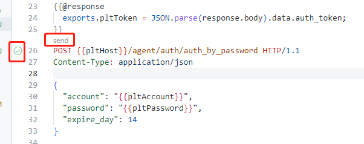

本目录为httpyac插件环境变量目录。

## 工具介绍
[httpyac](https://httpyac.github.io/)是一款http测试插件，支持以http脚本调用接口。httpyac支持在http脚本中使用环境变量、动态变量、js脚本等，非常灵活，还可以以注释的形式编写描述性文档。

为了不让脚本变复杂，仅使用其环境变量及注释特性，以方便接口调用及文档编写，不在其中编写其他复杂的js代码，达到其同时作为文档与测试工具的目的。

## 使用方法
*如果你无需使用测试工具，则可直接将其作为纯文档看待，无需继续阅读。*

#### 安装
下载安装vscode，并搜索安装httpyac插件（然后可能需重开vscode）。

#### 配置环境变量
复制一份`.env.template`重命名为`.env`，补上你的账号密码，若非测试线上环境则对应修改pltHost，pltToken无需填写。

*.env为全局配置，httpyac支持多环境配置，支持切换，有兴趣可自行官网了解*

#### 测试

###### 登录
1. 打开`platform/agent-auth.http`
2. 点击下图红框的send或小图标


此时将以你环境变量配置的账号密码发送登录请求，响应的`auth_token`会保存到`pltToken`直到vscode关闭，你可以在其他http请求中使用该变量发请求。

###### 取登陆者信息
同样在`platform/agent-auth.http`中找到`logged_info`接口，点击send或小图标即可发送请求，该请求将携带上述登录得到的`auth_token`，此时你将成功拿到账号信息响应。

###### 取agent列表
agent列表在不同的http脚本文件中，我们试试是否能成功以上述登录拿到的`auth_token`请求接口

打开`platform/agent-management.http`，找到`agent/agent_mgmt/list`接口，点击send或小图标发送请求，你会看到成功响应了agent list。

因为该文件同步有下述脚本，会导入`agent-auth.http`中导出的变量供当前文件使用，所以能成功以上述登录拿到的`auth_token`发送请求。
```http
# @import ./agent-auth.http
# @ref authByPassword
```


大概就是这样了，挺方便的是吧，用它能在测试的时候顺便把文档写了，或者文档不太好看时直接试试请求接口。

vscode上还有一些其他的、用户更多的http测试插件，但用起来都不怎么方便，要么不支持环境变量，要么变量作用域仅为当前文件。找了很久准备放弃时找到了这个小众的插件，这个httpyac配好后，基本可以媲美或超越图形化api测试工具了。缺点嘛，就是较小众，可能会有一些BUG没被及时修复。Jetbrains系IDE自带有http测试插件，也支持环境变量，但用IDE来写文档有点重了。